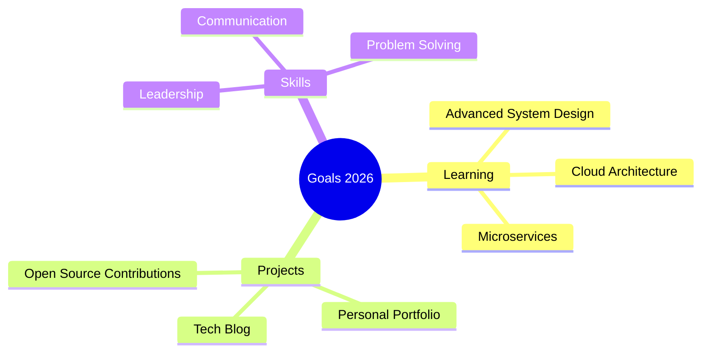

# README

<div align="center">
  
</div>
<div align="center">
<div align="center">
  
# 👋 Hi there, I'm Balamurugan! 
### 🚀 Developer | 💡 Problem Solver | 🎯 Tech Enthusiast


<br/>


<br/>

</div>


## 🎭 About Me


```typescript
const balamurugan = {
    pronouns: "He" | "Him",
    code: ["JavaScript",  "Python", "Java"],
    askMeAbout: ["web dev", "tech", "app dev", "gaming"],
    technologies: {
        frontEnd: {
            js: ["React"],
            css: [ "Material UI"]
        },
        backEnd: {
            js: ["Node"],
            python: ["Django", "Flask", "FastAPI"]
        },
        databases: ["MongoDB", "MySQL","Firebase"],
        devOps: ["Docker🐳"],
        misc: ["Firebase", ]
    },
    currentFocus: "Building scalable applications 🚀",
    funFact: "I debug with console.log() 😄"
};
```


## 🛠️ Tech Stack & Tools

<div align="center">

### 💻 Languages


### 🎨 Frontend


### ⚙️ Backend


### 🗄️ Databases


### 🚀 DevOps & Tools


</div>


## 📊 GitHub Statistics

<div align="center">
   
  
</div>

<div align="center">
  
  
</div>


## 🏆 GitHub Trophies

<div align="center">
  
</div>


## 📈 Contribution Graph

<div align="center">
  
</div>


## 🎯 Current Focus

<div align="center">



</div>


## 💡 Random Dev Quote

<div align="center">
  
</div>


## 🎮 When I'm Not Coding

<div align="center">

🎯 Gaming | 📚 Reading Tech Blogs | 🎧 Listening to Music | ✈️ Exploring New Places | 🍕 Foodie Adventures

</div>


## 📫 Connect With Me

<div align="center">

[](https://www.linkedin.com/in/balamurugan-t4256/)
[](https://x.com/BALAMURUGA84545)
[](mailto:bala4256t@gmail.com)
[](https://github.com/BalamuruganT006)

</div>


<div align="center">

### 💬 Visitor Count


### ⭐ Show some ❤️ by starring repositories you find interesting!


</div>
