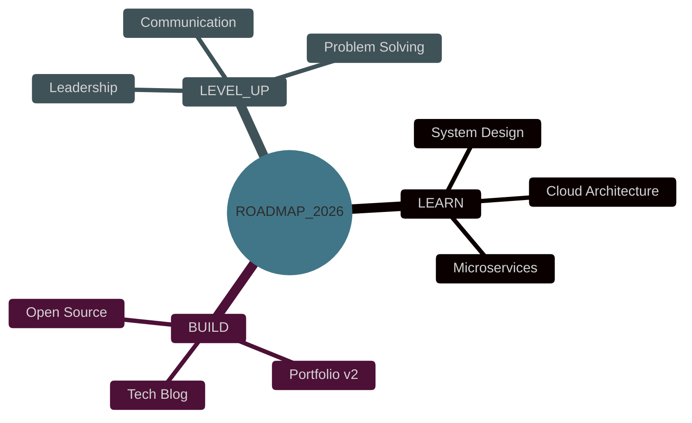

<div align="center">


<br/>


<br/><br/>

[](#)
[](https://www.linkedin.com/in/balamurugan-t4256/)
[](https://x.com/BALAMURUGA84545)
[](mailto:bala4256t@gmail.com)


</div>


## `<terminal>` about_me.sh


```bash
$ whoami
> Balamurugan — Full Stack Developer

$ cat mission.txt
> Building scalable, future-ready applications
> that push what's possible on the web.

$ ls -la ./interests
drwxr-xr-x  web-dev
drwxr-xr-x  app-dev
drwxr-xr-x  cloud-architecture
drwxr-xr-x  gaming

$ echo $CURRENT_FOCUS
> "Advanced system design & microservices" 🛰️

$ echo $FUN_FACT
> "I debug with console.log() — the OG debugger" 😄
```

<br clear="right">


## `⟨` TECH ARSENAL `⟩`

<div align="center">

### ▸ CORE LANGUAGES


### ▸ FRONTEND MATRIX


### ▸ BACKEND CORE


### ▸ DATA VAULTS


### ▸ DEPLOYMENT GRID


</div>


</div>

<div align="center">
  
  

## `⟨` ACHIEVEMENT CORE `⟩`

<div align="center">


`QUICKDRAW`&nbsp;&nbsp;`YOLO`&nbsp;&nbsp;`PULL_SHARK`&nbsp;&nbsp;`PAIR_EXTRAORDINAIRE`

<br/>


</div>


## `⟨` FEATURED BUILDS `⟩`

<div align="center">
  <a href="https://github.com/BalamuruganT006/Skeduler">
    
  </a>
  <a href="https://github.com/BalamuruganT006/Blocksmiths">
    
  </a>
</div>

> ⚙️ *Showing `Skeduler` (auto timetable generator) and `Blocksmiths`. Swap in any of your other 37 repos anytime by changing the `repo=` value.*


## `⟨` MISSION.LOG — 2026 ROADMAP `⟩`

<div align="center">



</div>


## `⟨` RANDOM.QUOTE() `⟩`

<div align="center">
  
</div>


## `⟨` OFFLINE_MODE `⟩`

<div align="center">

🎮 Gaming &nbsp;▸&nbsp; 📡 Tech Blogs &nbsp;▸&nbsp; 🎧 Music &nbsp;▸&nbsp; 🛰️ Exploring &nbsp;▸&nbsp; 🍕 Food Runs

</div>


## `⟨` ESTABLISH_CONNECTION `⟩`

<div align="center">

[](https://www.linkedin.com/in/balamurugan-t4256/)
[](https://x.com/BALAMURUGA84545)
[](mailto:bala4256t@gmail.com)
[](https://github.com/BalamuruganT006)

</div>

<div align="center">

### `if ( you_liked_this_repo ) { star_it(); }` ⭐

</div>


